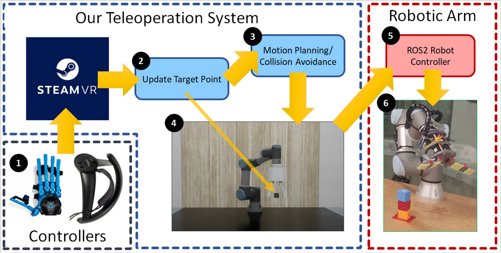

# Telesim PnP

Reduced Package only for Baxter for Telesim, a modular and plug and play teleoperation system, that can be used with any kind of robotic arms. The master repository can be found [here](https://github.com/09ubberboy90/telesim_pnp)



## Paper Abstract

This repository is published along with a paper [A Modular and Plug-and-Play Framework for Robotic Arm Teleoperation using a Digital Twin](TODO). Please cite it if you use part of this package.

TODO: Include abstract and paper link

## Needed packages

- Omniverse Isaac Sim
- SteamVR
- ROS1 Noetic
- ROS2 Galactic (May work on other version but has not been tested)

## Installation

This repository contains multiple submodules of the needed pakckages. Please use:

`git clone --recurse-submodules git@github.com:09ubberboy90/telesim_pnp`

or

`git clone --recurse-submodules https://github.com/09ubberboy90/telesim_pnp.git`

to download all of them

Navigate to the ROS1 folder and use catkin_make to build the workspace. Make sure you have sourced ROS Noetic before doing so.

Navigate to the ROS2 folder and use colcon build to build the workspace. Make sure you have sourced ROS Galactic before doing so. ROS noetic needs to be installed to build any of the baxter packages but does not need to be sourced

Source the local workspace and ROS2 for all the following steps except Isaac Sim.

## How to Use

More detailed version of the each part of setup can be found on the individual repositories.

### [VR](https://github.com/09ubberboy90/vr_publisher)

Run SteamVR and make sure to reset the origin of the headset.

Build and source the workspace using `colcon build`

Run this package by using:

`ros2 run vr_publish vr_publish`

### [Isaac Sim](https://github.com/09ubberboy90/telesim_isaac)

BEWARE: Do not source ROS or have ROS sourced for the following !

Find your isaac sim python path; It should be in `~/.local/share/ov/pkg/isaac_sim-2022.2.0/python.sh`. It will be referred henceforth as `isp`

Then you need to export the path of the packages you are going to use so that Isaac Sim can load them.

`export ROS_PACKAGE_PATH=ROS_PACKAGE_PATH:/opt/ros/galactic/share`

Note: This will only load the packages installed through APT not the local packages. You need to add them manually (See below for example)

#### First Time Usage

Make sure you also have installed pyquaternion for Isaac Sim. This can be done by running:

`isp -m pip install pyquaternion`

Make sure you have updated the urdf and rmp path according to your need in either [ur_world.py](ur3/ur_world.py) or [baxter_world.py](baxter/baxter_world.py) file. They are defined in the init as `self.urdf` and `self.rmp` respectively

To add the packages needed for Baxter:

`export ROS_PACKAGE_PATH=ROS_PACKAGE_PATH:{ros_ws}/install/rethink_ee_description/share:{ros_ws}/install/baxter_description/share`

To run for baxter

`isp ROS2/src/isaac_sim/baxter/baxter_world.py`


## Real robot control

Baxter needs to have some terminal using ROS1 and ROS2

### ROS1

Run the following command

``` sh
source ROS1/devel/setup.zsh
export ROS_IP="{Your PC IP}"
export ROS_MASTER_URI="{Baxter IP}"
rosrun baxter_tools enable_robot.py -e
```

### ROS2

Run the following command

```sh
export ROS_IP="{Your PC IP}"
export ROS_MASTER_URI="{Baxter IP}"
ros2 launch baxter_bridge baxter_bridge_launch.py
```

and in another terminal

`ros run baxter_joint_controller controller`

